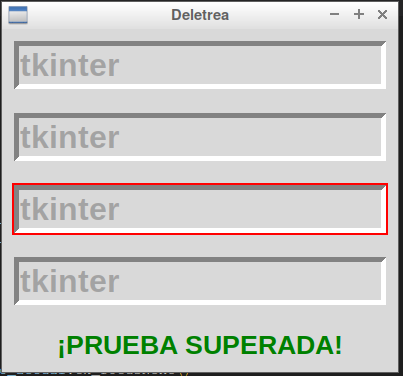
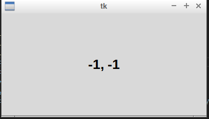
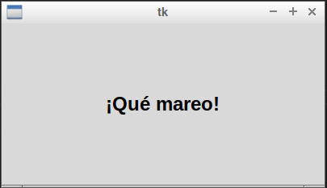

# 3_metodos_comunes

## metodos comunes foco

### esto nos muestra una serie de parrafos que va cambiando aleatoriamente y tenemos que poner una palabra

### esto nos muerta las cordenadas de la posicion de nustro raton 

### esto nos enseña como hacer que un texto se vuelva grande o pequeño 

